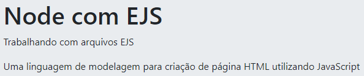
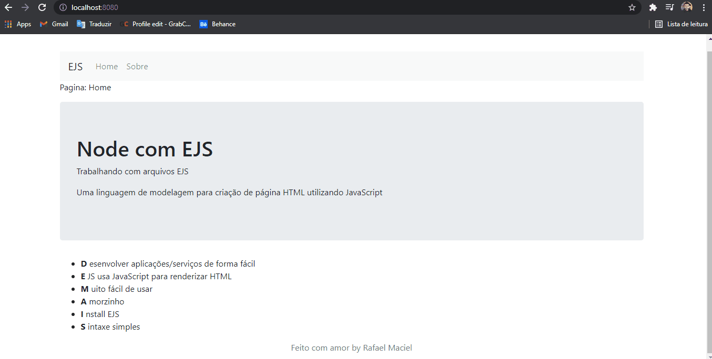

<h1 align="center">
  
</h1>

<h3 align="justify">
Node with EJS is an academic demonstration of a web application using NodeJS, EJS and JavaScript. Credits for the NodeJS + EJS module: Smart HTML from rocketseat's Discovery track.
</h3>

 

## 📷 Demonstration

  

 

## 🚀 Technologies

This project was developed with the following technologies:

- NodeJS
- EJS
- JavaScript

 

## ⚙ Settings
- npm install ejs
- npm install express
- create server.js
- node server
- ../views/index.ejs

 

---

Made with 💜 by Rafael Maciel
